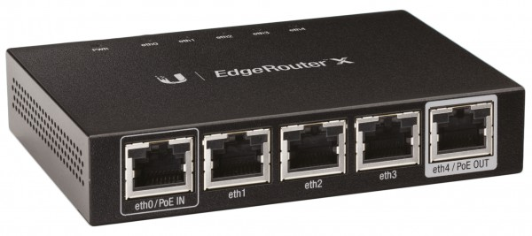
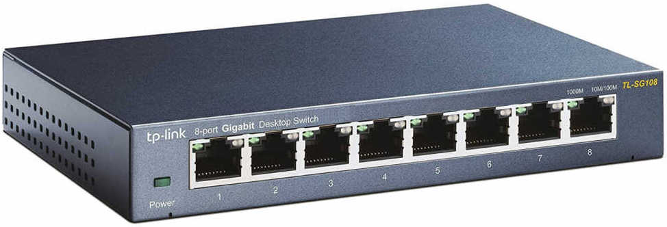
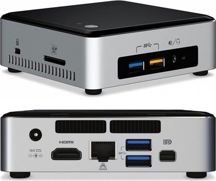

# Cloudkoffer v1

## Case

## Router

## Switch

## Node

### Specifications

Name       | Description
---------- | -----------
Type       | [Intel NUC Kit NUC6i3SYB](https://ark.intel.com/content/www/us/en/ark/products/89186/intel-nuc-kit-nuc6i3syk.html) ([Specs](https://www.intel.com/content/dam/support/us/en/documents/boardsandkits/NUC6i5SYB_NUC6i3SYB_TechProdSpec.pdf))
UEFI       | [SYSKLi35.86A.0073.2020.0909.1625](https://www.intel.com/content/www/us/en/download/18449/bios-update-syskli35.html)
Processor  | Intel Core i3-6100U :material-circle-medium: Base Frequency: 2.30 GHz :material-circle-medium: Cache: 3 MB (L3) :material-circle-medium: Cores/Threads: 2/4
Memory     | 32 GB - 2x 16 GB (DDR4-2133)
Graphics   | Intel Iris Graphics 520 :material-circle-medium: Mini-DP 1.2 :material-circle-medium: HDMI 1.4b
Storage    | :material-chevron-right-circle: Samsung SSD 850 Evo 250 GB
Networking | :material-chevron-right-circle: Intel Ethernet Connection I219-V :material-chevron-right-circle: Intel Wireless-AC 8260 + Bluetooth 4.2
TDP        | 15 W
Features   | :material-chevron-right-circle: SDXC (with UHS-I support)

### MAC Addresses

Name   | Address
------ | -------
Node 1 | f4:4d:30:60:70:42
Node 2 | f4:4d:30:60:68:db
Node 3 | f4:4d:30:60:6c:9c
Node 4 | f4:4d:30:60:6d:0d
Node 5 | f4:4d:30:60:70:62

### UEFI

??? abstract "Configuration details"

    - Advanced
        - Main
            - Default Visual BIOS Start Page > `Home Page 1`
            - Event Log
                - Clear Event Log > `unchecked`
                - Event Logging > `checked`
        - Devices
            - USB
                - USB Configuration
                    - USB Legacy > `checked`
                    - Portable Device Charging Mode > `Charging in S3/S4/S5`
                - USB Ports
                    - USB Port 0x: `Enable`
            - SATA
                - Chipset SATA Controller Configuration
                    - Chipset SATA > `checked`
                    - Chipset SATA Mode > `AHCI`
                    - S.M.A.R.T > `checked`
                    - SATA Port > `checked`
                    - Hard Disk Pre-Delay > `0`
                    - HDD Activity LED > `checked`
            - Video
                - Video Configuration
                  - IDG Minimum Memory > `64 MB`
                  - IDG Aperture Size > `256 MB`
                  - IDG Primary Video Port > `Auto`
            - Onboard Devices
                - Onboard Device Configuration
                    - Audio > `unchecked`
                    - LAN > `checked`
                    - WLAN > `unchecked`
                    - Bluetooth > `unchecked`
                    - SD Card > `read/write`
                - Legacy Device Configuration
                    - Enhance Consumer IR > `unchecked`
                    - High Precision Event Timers > `checked`
                    - Num Lock > `Checked`
            - PCI
                - PCI Configuration
                    - PCI Latency Timer > `32`
                    - M.2 Slot > `checked`
        - Cooling
            - CPU Fan Header
                - Fan Control Mode > `Cool`
                - Minimum Duty Cycle (%) > `35`
                - Primary Temperature Sensor > `Processor`
                - Minimum Temperature (°C) > `71`
                - Duty Cycle Increment (%/°C) > `2`
                - Secondary Temperature Sensor > `Memory`
                - Minimum Temperature (°C) > `68`
                - Duty Cycle Increment (%/°C) > `2`
        - Performance
            - Processor
                - Core Settings
                    - Intel Hyper-Threading Technology > `checked`
                    - Active Processor Cores > `ALL`
                    - Real-Time Performance Tuning > `checked`
                    - Silicon Debug Features > `unchecked`
            - Memory
                - General Settings
                    - Memory Profiles > `Automatic`
                    - Round Trip Latency > `checked`
                    - TCR > `Disabled`
        - Security
            - Password
                - Supervisor Password > `Not installed`
                - User Password > `Not installed`
                - Master Hard Disk Drive Password > `Not installed`
                - Hard Disk Drive Password > `Not installed`
                - Hard Disk Drive Password Prompt > `checked`
            - Security Features
                - Allow UEFI 3rd party driver loaded > `unchecked`
                - Unattended BIOS Configuration > `Always Prompt`
                - Execute Disable Bit > `checked`
                - Intel Virtualization Technology > `checked`
                - Intel VT for Directed I/O (VT-d) > `checked`
                - Fixed Disk Boot Selector > `Normal`
                - Intel Platform Trust Technology > `unchecked`
                - Intel Software Guard Extenstion (SGX) > `Software Controlled`
                - SGX Owner EPOCHs > `Factory Default`
        - Power
            - Primary Power Settings
                - Balanced Enabled > `unchecked`
                - Low Power Enabled > `unchecked`
                - Max Performance Enabled > `checked`
            - Secondary Power Settings
                - Power Sense > `checked`
                - After Power Failure > `Stay Off`
                - Deep S4/S5 > `unchecked`
                - S0 State Indicator > `ON (solid, primary color)`
                - S3 State Indicator > `Blink (alternate color @ 0.25 Hz)`
                - Wake on LAN from S4/S5 > `Power On - PXE Boot`
                - Wake System from S5 > `unchecked`
                - USB S4/S5 Power > `unchecked`
                - PCIe ASPM Power > `checked`
                - Native ACPI OS PCIe Supprt > `unchecked`
                - Flash Update Sleep Delay > `unchecked`
        - Boot
            - Boot Priority
                - UEFI Boot Priority
                    - UEFI Boot > `checked`
                - Legacy Boot Priority
                    - Legacy Boot > `unchecked`
            - Boot Configuration
                - Boot UEFI
                    - Fast Boot > `unchecked`
                    - Boot USB Devices First > `checked`
                    - Boot Network Devices Last `checked`
                    - Unlimited Boot to Network Attempts > `unchecked`
                    - BIOS Setup Auto-Entry > `unchecked`
              - Boot Devices
                  - Internal UEFI Shell > `unchecked`
                  - USB > `checked`
                  - Optical > `checked`
                  - Network Boot > `UEFI PXE & iSCSI`
              - Boot Display Config
                  - Failsafe Watchdog > `checked`
                  - Suppress Alert Messages At Boot > `unchecked`
                  - Expansion Card Test > `Disable`
                  - Keyboard Ready Beep > `unchecked`
                  - POST Function Hotkeys Displayed > `checked`
                  - Display F2 to Enter Setup > `checked`
                  - Display F7 to Update BIOS > `checked`
                  - Display F10 to Enter Boot Menu > `checked`
                  - Display F12 for Network Boot > `checked`
          - Secure Boot
              - Secure Boot Config
                  - Securte Boot > `unchecked`
