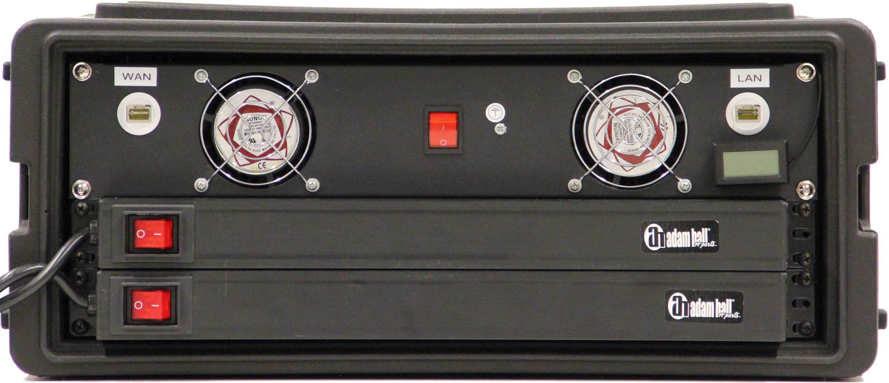
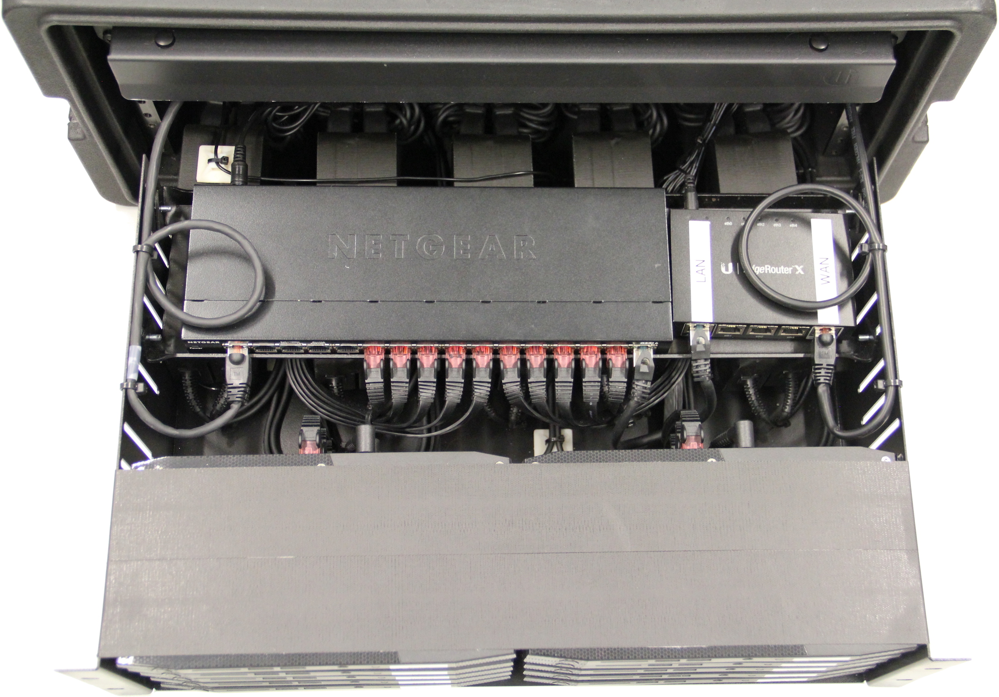
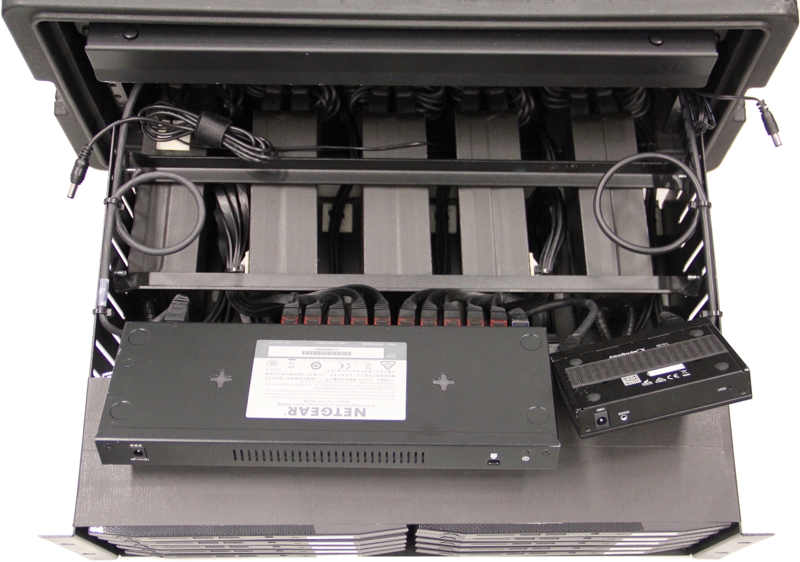
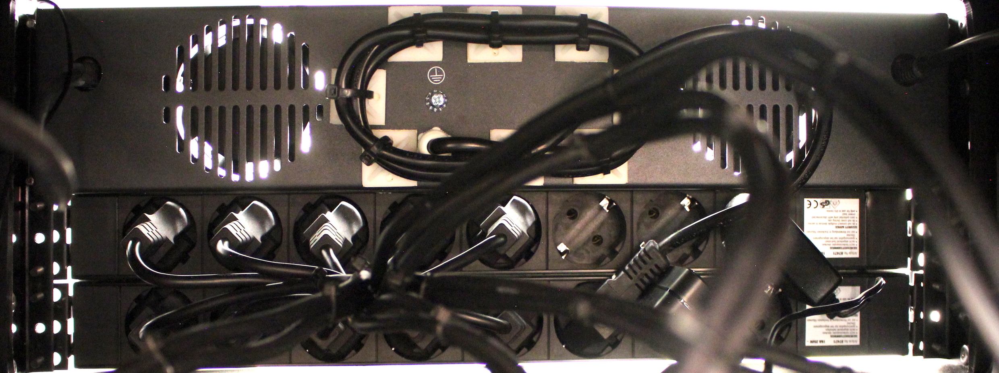
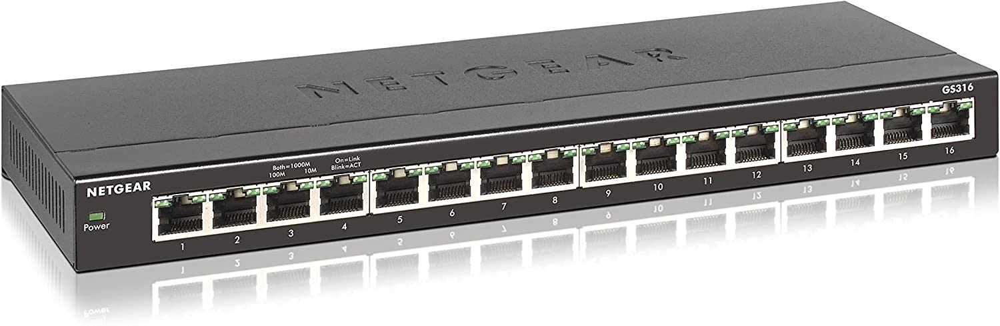

# Cloudkoffer v2

<figure markdown="span">
  
  <figcaption>Front view (outer)</figcaption>
</figure>

<figure markdown="span">
  
  <figcaption>Back view (outer)</figcaption>
</figure>

<figure markdown="span">
  
  <figcaption>Top view (inner)</figcaption>
</figure>

<figure markdown="span">
  
  <figcaption>Power supply arrangement</figcaption>
</figure>

<figure markdown="span">
  
  <figcaption>Back view (inner)</figcaption>
</figure>

## Case

## Router

## Switch

## Node

Name       | Description
---------- | -----------
Type       | [Intel NUC Kit NUC6i7KYB](https://ark.intel.com/content/www/us/en/ark/products/89187/intel-nuc-kit-nuc6i7kyk.html) ([Specs](https://www.intel.com/content/dam/support/us/en/documents/boardsandkits/NUC6i7KYK_TechProdSpec.pdf))
UEFI       | [KYSKLi70.86A.0074.2021.1029.0102](https://www.intel.com/content/www/us/en/download/18677/bios-update-kyskli70.html)
Processor  | Intel Core i7-6770HQ :material-circle-medium: Base Frequency: 2.60 GHz :material-circle-medium: Turbo Frequency: 3.50 GHz :material-circle-medium: Cache: 6 MB (L3), 128 MB (L4) :material-circle-medium: Cores/Threads: 4/8
Memory     | 32 GB - 2x 16 GB (DDR4-2133)
Graphics   | Intel Iris Pro Graphics 580 :material-circle-medium: Mini-DP 1.2 :material-circle-medium: HDMI 2.0 :material-circle-medium: USB-C (DP1.2)
Storage    | :material-chevron-right-circle: Samsung SSD 960 PRO 1 TB
Networking | :material-chevron-right-circle: Intel Ethernet Connection I219-LM :material-chevron-right-circle: Intel Wireless-AC 8260 + Bluetooth 4.2
TDP        | 45 W
Features   | :material-chevron-right-circle: Thunderbolt 3 (40Gbps) :material-chevron-right-circle: USB 3.1 Gen 2 (10Gbps) :material-chevron-right-circle: SDXC (with UHS-I support)

### MAC Addresses

Name    | Address
------- | -------
Node 1  | 00:1f:c6:9c:1c:a0
Node 2  | 00:1f:c6:9c:1a:b0
Node 3  | 00:1f:c6:9c:1c:fe
Node 4  | 00:1f:c6:9c:1a:ac
Node 5  | 00:1f:c6:9c:1a:ae
Node 6  | 00:1f:c6:9c:1c:60
Node 7  | 00:1f:c6:9c:1a:b1
Node 8  | 00:1f:c6:9c:1c:64
Node 9  | 00:1f:c6:9c:1c:8d
Node 10 | 00:1f:c6:9c:1c:5a

### UEFI

??? abstract "Configuration details"

    - Advanced
        - Main
            - Default Visual BIOS Start Page > `Home Page 1`
            - Event Log
                - Clear Event Log > `unchecked`
                - Event Logging > `checked`
        - Devices
            - USB
                - USB Configuration
                    - USB Legacy > `checked`
                    - Portable Device Charging Mode > `Charging in S3/S4/S5`
                - USB Ports
                    - USB Port 0x: `Enable`
            - SATA
                - Chipset SATA Controller Configuration
                    - Chipset SATA > `checked`
                    - Chipset SATA Mode > `AHCI`
                    - S.M.A.R.T > `checked`
                    - Hard Disk Pre-Delay > `0`
                    - HDD Activity LED > `checked`
                    - M.2 PCIe SSD LED > `checked`
            - Video
                - Video Configuration
                  - IDG Minimum Memory > `64 MB`
                  - IDG Aperture Size > `256 MB`
                  - IDG Primary Video Port > `Auto`
            - Onboard Devices
                - Onboard Device Configuration
                    - Audio > `unchecked`
                    - LAN > `checked`
                    - WLAN > `unchecked`
                    - Bluetooth > `unchecked`
                    - SD Card > `read/write`
                - Legacy Device Configuration
                    - Enhance Consumer IR > `unchecked`
                    - High Precision Event Timers > `checked`
                    - Num Lock > `Checked`
            - PCI
                - PCI Configuration
                    - M.2 Slot 1 > `checked`
                    - M.2 Slot 2 > `checked`
        - Cooling
            - CPU Fan Header
                - Fan Control Mode > `Cool`
                - Minimum Duty Cycle (%) > `27`
                - Primary Temperature Sensor > `Processor`
                - Minimum Temperature (°C) > `65`
                - Duty Cycle Increment (%/°C) > `2`
        - Performance
            - Processor
                - Core Settings
                    - Intel Hyper-Threading Technology > `checked`
                    - Intel Tubrbo Boost Technology > `checked`
                    - Active Processor Cores > `ALL`
                    - Real-Time Performance Tuning > `checked`
                    - Silicon Debug Features > `unchecked`
            - Memory
                - General Settings
                    - Memory Profiles > `Automatic`
                    - Round Trip Latency > `checked`
                    - TCR > `Disabled`
        - Security
            - Password
                - Supervisor Password > `Not installed`
                - User Password > `Not installed`
            - Security Features
                - Allow UEFI 3rd party driver loaded > `unchecked`
                - Unattended BIOS Configuration > `Always Prompt`
                - Execute Disable Bit > `checked`
                - Intel Virtualization Technology > `checked`
                - Intel VT for Directed I/O (VT-d) > `checked`
                - Fixed Disk Boot Selector > `Normal`
                - Intel Platform Trust Technology > `unchecked`
                - Intel Software Guard Extenstion (SGX) > `Software Controlled`
                - SGX Owner EPOCHs > `Factory Default`
                - Thunderbolt Security Level > `Unique ID`
        - Power
            - Primary Power Settings
                - Balanced Enabled > `unchecked`
                - Low Power Enabled > `unchecked`
                - Max Performance Enabled > `checked`
            - Secondary Power Settings
                - Power Sense > `checked`
                - After Power Failure > `Stay Off`
                - Deep S4/S5 > `unchecked`
                - S0 State Indicator > `ON (solid, primary color)`
                - S3 State Indicator > `Blink (alternate color @ 0.25 Hz)`
                - Wake on LAN from S4/S5 > `Power On - PXE Boot`
                - Wake System from S5 > `unchecked`
                - USB S4/S5 Power > `unchecked`
                - PCIe ASPM Power > `checked`
                - Native ACPI OS PCIe Supprt > `checked`
                - Flash Update Sleep Delay > `unchecked`
        - Boot
            - Boot Priority
                - UEFI Boot Priority
                    - UEFI Boot > `checked`
                - Legacy Boot Priority
                    - Legacy Boot > `unchecked`
            - Boot Configuration
                - Boot UEFI
                    - Fast Boot > `unchecked`
                    - Boot USB Devices First > `checked`
                    - Boot Network Devices Last `checked`
                    - Unlimited Boot to Network Attempts > `unchecked`
                    - BIOS Setup Auto-Entry > `unchecked`
              - Boot Devices
                  - Internal UEFI Shell > `unchecked`
                  - USB > `checked`
                  - Optical > `checked`
                  - Network Boot > `UEFI PXE & iSCSI`
              - Boot Display Config
                  - Failsafe Watchdog > `checked`
                  - Suppress Alert Messages At Boot > `unchecked`
                  - Expansion Card Test > `Disable`
                  - Keyboard Ready Beep > `unchecked`
                  - POST Function Hotkeys Displayed > `checked`
                  - Display F2 to Enter Setup > `checked`
                  - Display F7 to Update BIOS > `checked`
                  - Display F10 to Enter Boot Menu > `checked`
                  - Display F12 for Network Boot > `checked`
          - Secure Boot
              - Secure Boot Config
                  - Securte Boot > `unchecked`
