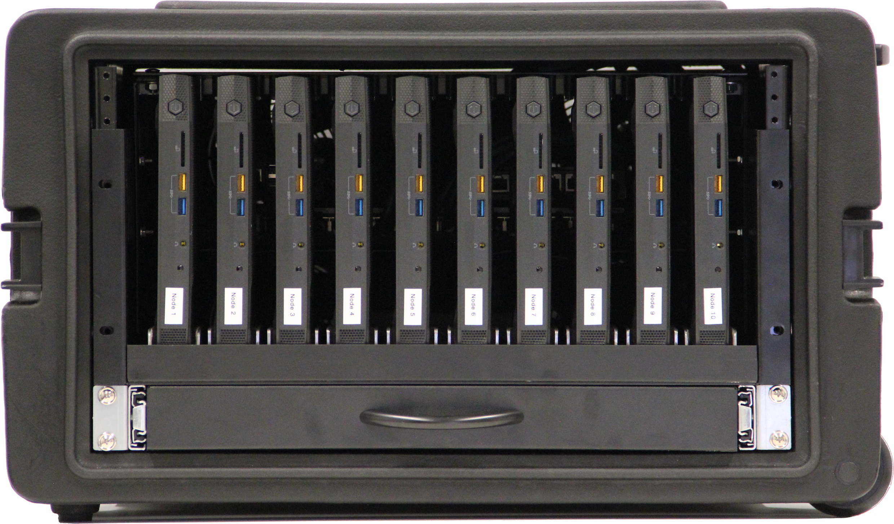

# Revision v3

<figure markdown="span">
  
  <figcaption>Front view (outer)</figcaption>
</figure>

<figure markdown="span">
  
  <figcaption>Back view (outer)</figcaption>
</figure>

<figure markdown="span">
  
  <figcaption>Top view (inner) - 1</figcaption>
</figure>

<figure markdown="span">
  
  <figcaption>Top view (inner) - 2</figcaption>
</figure>

<figure markdown="span">
  
  <figcaption>Bottom view (outer)</figcaption>
</figure>

<figure markdown="span">
  
  <figcaption>Side view (inner)</figcaption>
</figure>

<figure markdown="span">
  
  <figcaption>Bottom view (inner)</figcaption>
</figure>

<figure markdown="span">
  
  <figcaption>Back view (outer)</figcaption>
</figure>

## Case

## Router

## Switch

## Node

