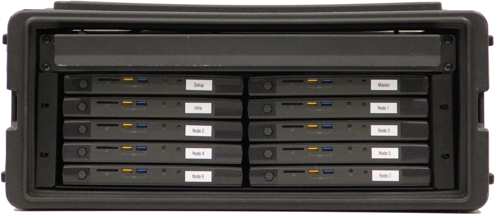

---
hide:
  - navigation
---

# Cloudkoffer

!!! example "Work in Progress"

    This website has recently been set up and will gradually be filled with content.

With this personal project I would like to show how easy it can be to build a mobile, mainly declarative and self-reproducible bare-metal developer platform based on Kubernetes with simple means. Rapidly deploying a local Kubernetes cluster may be a breeze these days, but when it comes to scaling and building a comprehensive open source developer platform, numerous challenges emerge.

<!--
## Building a Cluster

- Boot Talos in maintenence mode.
    - **Keyboard F12**
        - Ensure the nodes are shutdown.
        - Connect a keyboard to a node and press its power button.
        - Press F12 (repeatedly) during the boot process to trigger the network boot.
    - **Local Medium**
        - Prepare bootable USB flash drive or SD card (e.g. [balenaEtcher](https://www.balena.io/etcher)) using `talos-amd64.ios` from Talos GitHub [release page](https://github.com/siderolabs/talos/releases).
        - Ensure the nodes are shutdown.
        - Connect the local medium to a node and press its power button.
        - Select `Reset Talos installation` if Talos was previously installed, otherwise `Talos ISO`.

- Apply `Infrastructure as Code (IaC)`
- Apply `Configuration as Code (CaC)`
-->
