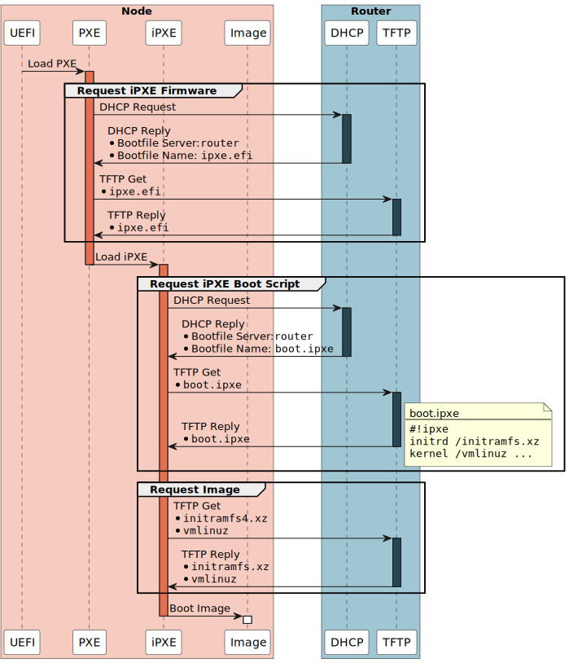

<!-- markdownlint-disable MD007 -->
<!-- markdownlint-disable MD033 -->
<!-- markdownlint-disable MD046 -->
# Router

## Roles

- Router
- DHCP Server
- DNS Server
- Boot Server (PXE/TFTP)

## Target State

Property | Value
--- | ---
**Subnet** | 192.168.1.0/24
**Dynamic DHCP Range** | 192.168.1.51 - 192.168.1.100
**Static DCHP Range** | 192.168.1.1 - 192.168.1.50
**Router** | 192.168.1.254
**DNS Server** | 192.168.1.254
**Boot Server** | 192.168.1.254
**Domain Name** | case.local
**Host Mapping**<br />Cloudkoffer v1 / v2 / v3<br /><br /><br /><br /><br /><br />Cloudkoffer v2 / v3<br /><br /><br /><br /><br /><br />Cloudkoffer v3 | kube: 192.168.1.101<br />node1: 192.168.1.1<br />node2: 192.168.1.2<br />node3: 192.168.1.3<br />node4: 192.168.1.4<br />node5: 192.168.1.5<br /><br />node6: 192.168.1.6<br />node7: 192.168.1.7<br />node8: 192.168.1.8<br />node9: 192.168.1.9<br />node10: 192.168.1.10<br /><br />switch: 192.168.1.253
**Upstream DNS Server** | 8.8.8.8, 1.1.1.1, 9.9.9.9

### Network Boot

<figure markdown="span">
  
  <figcaption>Network Boot State Diagram</figcaption>
</figure>

<figure markdown="span">
  
  <figcaption>Network Boot Sequence Diagram</figcaption>
</figure>

## Configuration

### Reset to Factory Defaults

To configure the router freshly, it must be reset first.
This can be done via a switch on the back of the router.
More detailed information can be found in the support article
[EdgeRouter - Reset to Factory Defaults](https://help.ui.com/hc/en-us/articles/205202620-EdgeRouter-Reset-to-Factory-Defaults>).
After resetting, a static IP address must be configured on the client, which configures the router.
Any address from the `192.168.1.0/24` subnet can be selected, although the router itself already uses `192.168.1.1`.
The initial username and the initial password are both `ubnt`.

### Firmware

Currently the firmware version `v2.0.9-hotfix.7.5622731` is in use.
The latest firmware can be checked and downloaded from the [Ubiquiti Download Portal](https://www.ui.com/download/software/er-x).
It is then possible to apply it via the web UI.

- [192.168.1.1](https://192.168.1.1) (initial), [192.168.1.254](https://192.168.1.254) (configured)
- System > Upgrade System Image

### UI Configurations

- [192.168.1.1](https://192.168.1.1) (initial), [192.168.1.254](https://192.168.1.254) (configured)
- Wizards > Setup Wizards > Basic Setup
    - DNS forwarding: `Use fast public DNS servers`
    - LAN ports > Address: `192.168.1.254` / `255.255.255.0`
    - User setup: `Keep existing user`

### CLI Configurations

- Connect to the router via ssh.

    ``` shell
    ssh ubnt@192.168.1.254
    ```

- Download the latest iPXE image.

    ``` shell
    sudo mkdir -p /var/lib/tftpboot
    sudo curl -s http://boot.ipxe.org/ipxe.efi -o /var/lib/tftpboot/ipxe.efi
    ```

- Create iPXE boot config.

    ``` shell
    sudo vi /var/lib/tftpboot/boot.ipxe
    ```

    ``` shell title="File: boot.ipxe" linenums="1"
    #!ipxe

    set menu-timeout 10000
    isset ${menu-default} || set menu-default talos

    :start
    menu install menu
    item --key t talos  Talos
    item --key r reset  Reset Talos
    item --gap
    item --key c config Configure settings
    item --key s shell  Drop to iPXE shell
    item --key b reboot Reboot node
    item --gap
    item --key x exit   Exit iPXE and continue UEFI boot
    choose --timeout ${menu-timeout} --default ${menu-default} selected || goto cancel
    set menu-timeout 0
    goto ${selected}

    :talos
    initrd /initramfs-amd64.xz
    kernel /vmlinuz-amd64 initrd=initramfs-amd64.xz earlyprintk=ttyS0 console=ttyS0 console=tty0 init_on_alloc=1 init_on_free=1 slab_nomerge pti=on consoleblank=0 nvme_core.io_timeout=4294967295 printk.devkmsg=on ima_template=ima-ng ima_appraise=fix ima_hash=sha512 talos.platform=metal
    boot || goto failed

    :reset
    initrd /initramfs-amd64.xz
    kernel /vmlinuz-amd64 initrd=initramfs-amd64.xz earlyprintk=ttyS0 console=ttyS0 console=tty0 init_on_alloc=1 init_on_free=1 slab_nomerge pti=on consoleblank=0 nvme_core.io_timeout=4294967295 printk.devkmsg=on ima_template=ima-ng ima_appraise=fix ima_hash=sha512 talos.platform=metal talos.experimental.wipe=system
    boot || goto failed

    :cancel
    echo You cancelled the menu, dropping you to a shell

    :shell
    echo Type 'exit' to get the back to the menu
    shell
    set menu-timeout 0
    goto start

    :failed
    echo Booting failed, dropping to shell
    goto shell

    :reboot
    reboot

    :exit
    exit

    :config
    config
    goto start
    ```

- Download the latest talos linux image.

    ``` shell
    TALOS_VERSION="v1.7.4"
    BASE_URL="https://github.com/siderolabs/talos/releases/download/${TALOS_VERSION}"
    sudo curl -sL "${BASE_URL}/initramfs-amd64.xz" -o /var/lib/tftpboot/initramfs-amd64.xz
    sudo curl -sL "${BASE_URL}/vmlinuz-amd64" -o /var/lib/tftpboot/vmlinuz-amd64
    ```

- Configure the router.

    ``` shell
    configure
    ```

    <!--
    ``` shell
    # # Already configured by the basic setup and just for documentation purpose
    # set service dhcp-server disabled false
    # set service dhcp-server hostfile-update disable
    # set service dhcp-server shared-network-name LAN authoritative enable
    # set service dhcp-server shared-network-name LAN subnet 192.168.1.0/24 default-router 192.168.1.254
    # set service dhcp-server shared-network-name LAN subnet 192.168.1.0/24 dns-server 192.168.1.254
    # set service dhcp-server shared-network-name LAN subnet 192.168.1.0/24 lease 86400
    # set service dhcp-server static-arp disable
    # set service dns forwarding listen-on switch0
    ```
    -->

    ``` shell
    # Configure DHCP server settings
    delete service dhcp-server shared-network-name LAN subnet 192.168.1.0/24 start
    set service dhcp-server shared-network-name LAN subnet 192.168.1.0/24 start 192.168.1.51 stop 192.168.1.100
    set service dhcp-server shared-network-name LAN subnet 192.168.1.0/24 domain-name case.local

    # Replace ISC DHCP with Dnsmasq to add DNS and PXE/TFTP server capabilities
    set service dhcp-server use-dnsmasq enable

    # Extend DNS cache size for better performance (default is 150)
    set service dns forwarding cache-size 1000

    # Use fast public DNS servers to forward requests
    set service dns forwarding name-server 8.8.8.8
    set service dns forwarding name-server 1.1.1.1
    set service dns forwarding name-server 9.9.9.9

    # Enable PXE/TFTP
    set service dns forwarding options "enable-tftp"
    set service dns forwarding options "tftp-root=/var/lib/tftpboot"

    # Configure iPXE - chainload boot script
    set service dns forwarding options "dhcp-boot=ipxe.efi"
    set service dns forwarding options "dhcp-userclass=set:ipxe,iPXE"
    set service dns forwarding options "dhcp-boot=tag:ipxe,boot.ipxe"

    # Disable proxy DHCP (175 for iPXE; 176 for no-pxedhcp; 1b for 1 byte)
    set service dns forwarding options "dhcp-option=encap:175, 176, 1b"

    # Disable UNMS
    set service unms disable

    # Disable IPv6
    set system ipv6 disable

    # Configure static host mapping
    set system static-host-mapping host-name router.case.local inet 192.168.1.254
    set system static-host-mapping host-name router.case.local alias router
    set system static-host-mapping host-name kube.case.local inet 192.168.1.101
    set system static-host-mapping host-name kube.case.local alias kube

    # Allow the router to resolve the FQDNs of hosts using just the shortnames
    set system domain-name case.local
    ```

    === "Cloudkoffer v1"

        ``` shell
        # DHCP - static host mappings
        set service dhcp-server shared-network-name LAN subnet 192.168.1.0/24 static-mapping node-1 ip-address 192.168.1.1
        set service dhcp-server shared-network-name LAN subnet 192.168.1.0/24 static-mapping node-1 mac-address f4:4d:30:60:70:42
        set service dhcp-server shared-network-name LAN subnet 192.168.1.0/24 static-mapping node-2 ip-address 192.168.1.2
        set service dhcp-server shared-network-name LAN subnet 192.168.1.0/24 static-mapping node-2 mac-address f4:4d:30:60:68:db
        set service dhcp-server shared-network-name LAN subnet 192.168.1.0/24 static-mapping node-3 ip-address 192.168.1.3
        set service dhcp-server shared-network-name LAN subnet 192.168.1.0/24 static-mapping node-3 mac-address f4:4d:30:60:6c:9c
        set service dhcp-server shared-network-name LAN subnet 192.168.1.0/24 static-mapping node-4 ip-address 192.168.1.4
        set service dhcp-server shared-network-name LAN subnet 192.168.1.0/24 static-mapping node-4 mac-address f4:4d:30:60:6d:0d
        set service dhcp-server shared-network-name LAN subnet 192.168.1.0/24 static-mapping node-5 ip-address 192.168.1.5
        set service dhcp-server shared-network-name LAN subnet 192.168.1.0/24 static-mapping node-5 mac-address f4:4d:30:60:70:62
        ```

    === "Cloudkoffer v2"

        ``` shell
        # DHCP - static host mappings
        set service dhcp-server shared-network-name LAN subnet 192.168.1.0/24 static-mapping node-1 ip-address 192.168.1.1
        set service dhcp-server shared-network-name LAN subnet 192.168.1.0/24 static-mapping node-1 mac-address 00:1f:c6:9c:1c:a0
        set service dhcp-server shared-network-name LAN subnet 192.168.1.0/24 static-mapping node-2 ip-address 192.168.1.2
        set service dhcp-server shared-network-name LAN subnet 192.168.1.0/24 static-mapping node-2 mac-address 00:1f:c6:9c:1a:b0
        set service dhcp-server shared-network-name LAN subnet 192.168.1.0/24 static-mapping node-3 ip-address 192.168.1.3
        set service dhcp-server shared-network-name LAN subnet 192.168.1.0/24 static-mapping node-3 mac-address 00:1f:c6:9c:1c:fe
        set service dhcp-server shared-network-name LAN subnet 192.168.1.0/24 static-mapping node-4 ip-address 192.168.1.4
        set service dhcp-server shared-network-name LAN subnet 192.168.1.0/24 static-mapping node-4 mac-address 00:1f:c6:9c:1a:ac
        set service dhcp-server shared-network-name LAN subnet 192.168.1.0/24 static-mapping node-5 ip-address 192.168.1.5
        set service dhcp-server shared-network-name LAN subnet 192.168.1.0/24 static-mapping node-5 mac-address 00:1f:c6:9c:1a:ae
        set service dhcp-server shared-network-name LAN subnet 192.168.1.0/24 static-mapping node-6 ip-address 192.168.1.6
        set service dhcp-server shared-network-name LAN subnet 192.168.1.0/24 static-mapping node-6 mac-address 00:1f:c6:9c:1c:60
        set service dhcp-server shared-network-name LAN subnet 192.168.1.0/24 static-mapping node-7 ip-address 192.168.1.7
        set service dhcp-server shared-network-name LAN subnet 192.168.1.0/24 static-mapping node-7 mac-address 00:1f:c6:9c:1a:b1
        set service dhcp-server shared-network-name LAN subnet 192.168.1.0/24 static-mapping node-8 ip-address 192.168.1.8
        set service dhcp-server shared-network-name LAN subnet 192.168.1.0/24 static-mapping node-8 mac-address 00:1f:c6:9c:1c:64
        set service dhcp-server shared-network-name LAN subnet 192.168.1.0/24 static-mapping node-9 ip-address 192.168.1.9
        set service dhcp-server shared-network-name LAN subnet 192.168.1.0/24 static-mapping node-9 mac-address 00:1f:c6:9c:1c:8d
        set service dhcp-server shared-network-name LAN subnet 192.168.1.0/24 static-mapping node-10 ip-address 192.168.1.10
        set service dhcp-server shared-network-name LAN subnet 192.168.1.0/24 static-mapping node-10 mac-address 00:1f:c6:9c:1c:5a
        ```

    === "Cloudkoffer v3"

        ``` shell
        # DHCP - static host mappings
        set service dhcp-server shared-network-name LAN subnet 192.168.1.0/24 static-mapping switch ip-address 192.168.1.253
        set service dhcp-server shared-network-name LAN subnet 192.168.1.0/24 static-mapping switch mac-address a0:04:60:08:f7:9f
        set service dhcp-server shared-network-name LAN subnet 192.168.1.0/24 static-mapping node-1 ip-address 192.168.1.1
        set service dhcp-server shared-network-name LAN subnet 192.168.1.0/24 static-mapping node-1 mac-address 00:1f:c6:9c:8b:2d
        set service dhcp-server shared-network-name LAN subnet 192.168.1.0/24 static-mapping node-2 ip-address 192.168.1.2
        set service dhcp-server shared-network-name LAN subnet 192.168.1.0/24 static-mapping node-2 mac-address 00:1f:c6:9c:86:8f
        set service dhcp-server shared-network-name LAN subnet 192.168.1.0/24 static-mapping node-3 ip-address 192.168.1.3
        set service dhcp-server shared-network-name LAN subnet 192.168.1.0/24 static-mapping node-3 mac-address 00:1f:c6:9d:09:08
        set service dhcp-server shared-network-name LAN subnet 192.168.1.0/24 static-mapping node-4 ip-address 192.168.1.4
        set service dhcp-server shared-network-name LAN subnet 192.168.1.0/24 static-mapping node-4 mac-address 00:1f:c6:9c:8a:20
        set service dhcp-server shared-network-name LAN subnet 192.168.1.0/24 static-mapping node-5 ip-address 192.168.1.5
        set service dhcp-server shared-network-name LAN subnet 192.168.1.0/24 static-mapping node-5 mac-address 00:1f:c6:9c:89:ca
        set service dhcp-server shared-network-name LAN subnet 192.168.1.0/24 static-mapping node-6 ip-address 192.168.1.6
        set service dhcp-server shared-network-name LAN subnet 192.168.1.0/24 static-mapping node-6 mac-address 00:1f:c6:9c:90:a7
        set service dhcp-server shared-network-name LAN subnet 192.168.1.0/24 static-mapping node-7 ip-address 192.168.1.7
        set service dhcp-server shared-network-name LAN subnet 192.168.1.0/24 static-mapping node-7 mac-address 00:1f:c6:9c:89:d7
        set service dhcp-server shared-network-name LAN subnet 192.168.1.0/24 static-mapping node-8 ip-address 192.168.1.8
        set service dhcp-server shared-network-name LAN subnet 192.168.1.0/24 static-mapping node-8 mac-address 00:1f:c6:9c:8f:f2
        set service dhcp-server shared-network-name LAN subnet 192.168.1.0/24 static-mapping node-9 ip-address 192.168.1.9
        set service dhcp-server shared-network-name LAN subnet 192.168.1.0/24 static-mapping node-9 mac-address 00:1f:c6:9c:92:a0
        set service dhcp-server shared-network-name LAN subnet 192.168.1.0/24 static-mapping node-10 ip-address 192.168.1.10
        set service dhcp-server shared-network-name LAN subnet 192.168.1.0/24 static-mapping node-10 mac-address 00:1f:c6:9c:91:e6
        ```

- Persist the configuration and reboot.

    ``` shell
    commit ; save
    exit
    reboot
    ```

Afterwards, the dhcp, dns and tftp server is active and the configured ip address on the client configuring the router can be removed.

## Maintenance

- Upgrade Talos `vmlinux` and `initramfs`.

    ``` shell
    ssh ubnt@192.168.1.254
    ```

    ``` shell
    TALOS_VERSION="v1.7.4"
    BASE_URL="https://github.com/siderolabs/talos/releases/download/${TALOS_VERSION}"
    sudo curl -sL "${BASE_URL}/initramfs-amd64.xz" -o /var/lib/tftpboot/initramfs-amd64.xz
    sudo curl -sL "${BASE_URL}/vmlinuz-amd64" -o /var/lib/tftpboot/vmlinuz-amd64
    ```

- Switch default boot menu entry.

    - Connect to router.

        ``` shell
        ssh ubnt@192.168.1.254
        ```

    - Open file `boot.ipxe`.

        ``` shell
        sudo vi /var/lib/tftpboot/boot.ipxe
        ```

    - Switch menu default to `talos` or `reset` (line 4).

        ``` shell
        # Boot into talos operating system.
        isset ${menu-default} || set menu-default talos

        # Wipe disk and boot into talos maintenance mode.
        isset ${menu-default} || set menu-default reset
        ```

    - Exit from router.

        ``` shell
        exit
        ```

- Show active configuration

    ``` shell
    ssh ubnt@192.168.1.254
    ```

    ``` shell
    show configuration | no-more
    ```

    ``` shell
    exit
    ```

## Useful links

- [EdgeRouter - DNS Forwarding Setup and Options](https://help.ui.com/hc/en-us/articles/115010913367)
- [EdgeRouter - DHCP Server Using Dnsmasq](https://help.ui.com/hc/en-us/articles/115002673188)
